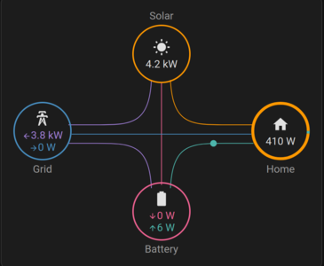

# Ampere.IQ-HA
Home Assistant sensor for Ampere Pro PV

Inspired by [some](https://community.home-assistant.io/t/energy-concepts-germany-solar-storage-ampere-storage-pro/693609) [existing](https://community.home-assistant.io/t/integration-of-ampere-iq-inverter-battery-and-kiwigrid-energy-manager/684978/8) attempts of getting EKD Ampere Pro PV values into Home Assistant, I created a sensor YAML that provides all relevant measurement values (power, energy, temp, charge..) via the Ampere.IQ Smartbox. The sensor integrates neatly into the energy dashboard and [Power Flow Card Plus](https://community.home-assistant.io/t/power-flow-card-plus/552326)

[]() &nbsp; &nbsp;
[]()

## Installation

Since I've only started with Home Assistant 4 days ago, there might be a better/official way to do this, but the following worked for me:

  - add your Smartbox's IP address to the YAML file
  - create an `integrations` directory in your configuration folder
  - copy the YAML file into the `integrations` dir
  - add the following to `configuration.yaml`
```
# include PV sensor
homeassistant:
  packages: !include_dir_named integrations
```
